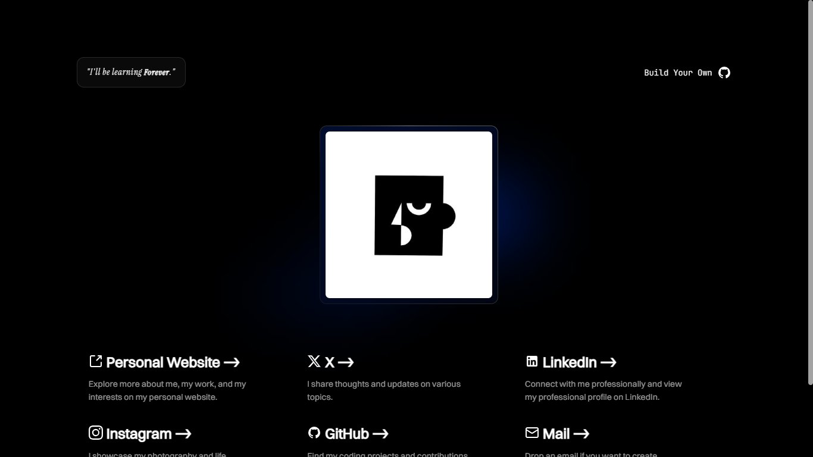

<h1 align="center">Links - A Linktree Clone for Developers</h1>

## Introduction

Welcome to Links, a Linktree clone designed specifically for
developers. This project aims to provide a simple and
customizable solution for creators to showcase their links on
the web.

## Preview



## Getting Started

### Prerequisites

* Install [Git](https://git-scm.com/downloads) on your machine.
* Ensure you have [Node.js](https://nodejs.org/en/) and [pnpm
(recommended)](https://pnpm.io/installation) installed.

### Steps to Set Up the Project.

1. Clone the repository:
```bash
git clone https://github.com/pruthivithejan/links.git
```
2. Navigate into the project directory:
```bash
cd links
```
3. Install the dependencies using pnpm:
```bash
pnpm install
```
4. Start the application in development mode:
```bash
pnpm run dev
```

This will start the project on your `localhost:5173`. Open a
web browser and navigate to `http://localhost:5173` to see if
it works.

## Configuration

### Content File

To customize the content, please replace everything in the
`content.ts` file with your information. [Image:
Public/preview/content.png]

```typescript
export const codeRepository = "linktree"; // Pointed to this
repository, but you can fork your own and update it.
export const githubUsername = "pruthivithejan"; // Required
because the site will pull your Github avatar and use it on the
website.
export const heading = "Pruthivi Thejan | Linktree"; // This is
the heading that shows in the browser tab.
export const slogan = {
  words: "I'll be myself or", // Slogan, put whatever you like.
  hightlight: "die trying", // Part of the slogan to highlight.
};

export const Cards = [
  {
    href: "https://x.com/pruthivithejan", // Change the link
here to your liking.
    icon: "x", // Please check if the `public/` folder has the
SVG to your link or place a one yourself, It must be a .svg
file.
    title: "X", // Change the title to your liking.
    description: "I share thoughts and updates on various
topics.", // Change the description to your liking.
  },
  // ... add more
```

## Additional Configuration

* Change the `meta` tags on index.html if needed.
* Save, come back, and see if the changes are made.

### Adding New Icons

If you want any new icons, add them to the `public` folder as
SVGs. You can find SVG icons
[here](https://icon-sets.iconify.design/).

### Custom Domain

If you're not using a custom domain, delete the `CNAME` file
and add your repository name to `vite.config.ts` as `base:
"/links/,`

## Deployment

Deploying is automatically set to GitHub Pages. Make sure you
[enable](https://docs.github.com/en/pages/quickstart) GitHub
Pages for the repository.

### Troubleshooting

* If you're not seeing any content, make sure the following are
correct:
  -  https://stackoverflow.com/questions/74518887/blank-page-when-dhttps://stackoverflow.com/questions/74518887/blank-page-when-deploying-a-react-app-to-github-pages-and-vite
  -  https://stackoverflow.com/questions/77348361/resolved-github-phttps://stackoverflow.com/questions/77348361/resolved-github-pages-deployment-blank-vite-react-ts

## Contributing and Licensing

✨ Leave a Star on the repository if you like. ✨ <br>

### License

[MIT](./LICENSE.md) &copy; [Pruthivi
Thejan](https://pruthivithejan.me/)